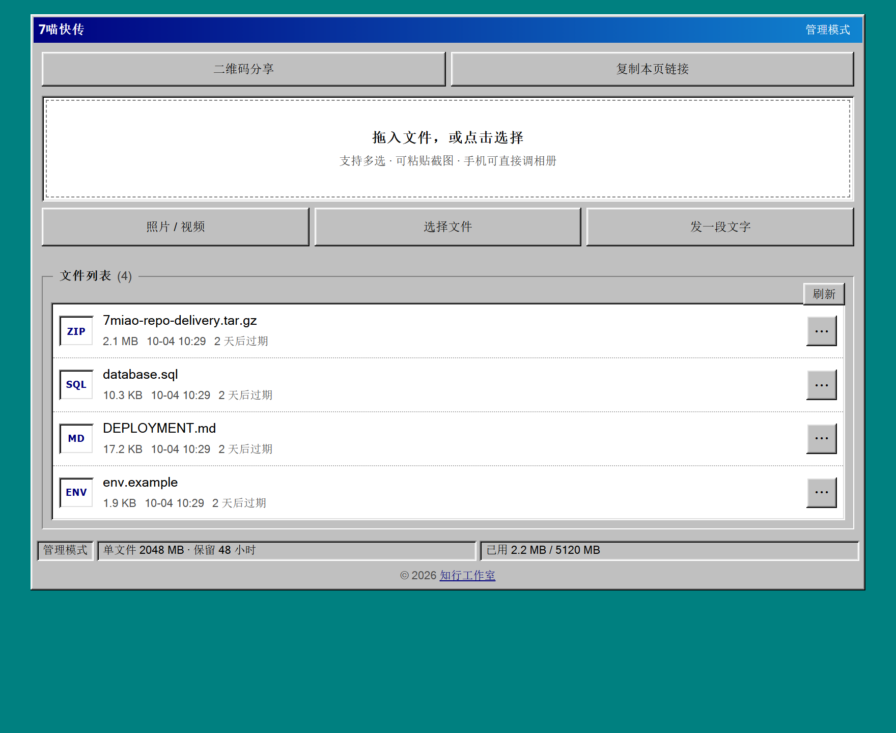
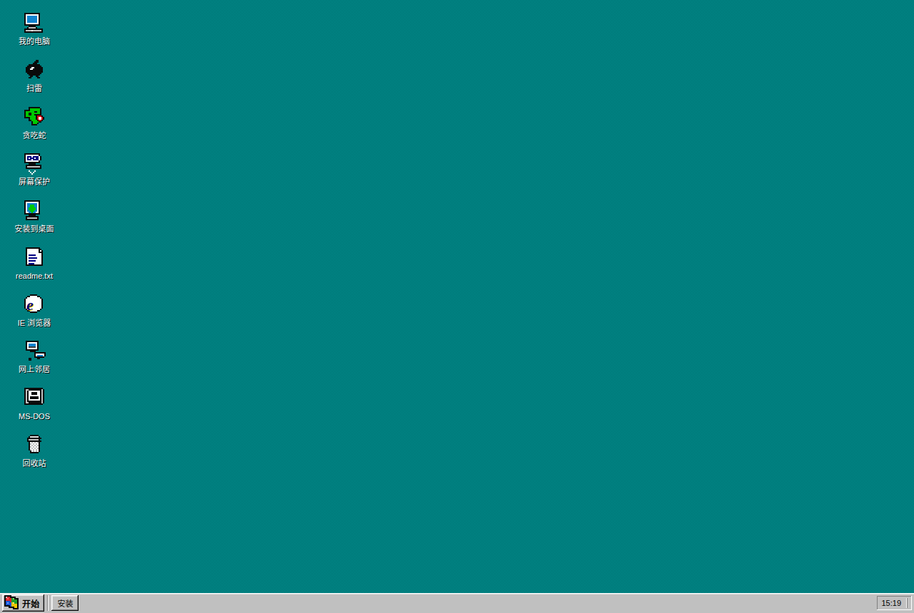
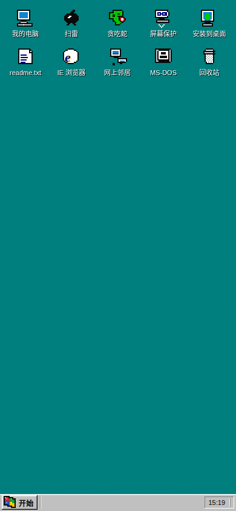

# 7M-Drop · 7喵快传

> **在线体验：https://coffee.app.workbuddy.host/**  （免安装，浏览器直接打开）


**单文件、零 npm 依赖的自托管文件中转服务，带一个能装进手机的 Win98 桌面。**

复制一个 `server.js` 到任何有 Node 的机器上，`node server.js` 就能跑。
没有 `npm install`、没有 lockfile、没有数据库、没有 Docker。

> A single-file, zero-dependency self-hosted file drop server. Retro Windows 98 UI,
> two-tier tokens, chunked upload, inline preview, QR sharing, installable PWA.
> `node server.js` and done.




<sub>更多截图：[Win98 桌面](docs/desktop.png) · [文件页预览](docs/filepage.png) · [手机桌面](docs/mobile-desktop.png) · [二维码分享](docs/qr-share.png)</sub>

## 理念

> **一个文件，一套做对了的权限模型，一个能装进手机的复古桌面。**

多数文件分享工具在解决「怎么把文件传出去」；7M-Drop 想多回答两个问题：

1. **它能不能塞进你现在就有的环境？** —— 不是「先装 Docker、再配数据库、再挂反代」，
   而是把一个 `server.js` 丢过去，`node server.js`，完事。零 npm 依赖，只用 Node 内置模块。
2. **它值不值得多看一眼？** —— 我们没用一块空白进度条打发你，而是做了整套 Windows 98 桌面：
   可拖动缩放的窗口、开始菜单、扫雷、贪吃蛇、MS-DOS 提示符。**这不是彩蛋，是产品的一部分**：
   把「传个文件」这件事做得让人愿意多停留两秒。

复古界面不只是玩票——它逼着我们把交互做扎实：真窗口管理、真滚动条、真右键菜单。
你看到的每个像素级细节（98 渐变标题栏、四色旗、3D 立体边）都是照着官方系统色还原的。

与作者的另一重身份呼应：知行工作室主张「知行合一」——
**知道一个工具为什么这么设计（认知），和它真的能用（行动），缺一不可。**

## 它和别的文件分享服务有什么不同

| | 常见做法 | 本项目的做法 |
|---|---|---|
| 部署 | Docker + 数据库 + 反向代理 | 一个文件，`node server.js` |
| 依赖 | 几十个 npm 包 | **0 个**（只用 Node 内置模块） |
| 分享链接的权限 | 能看就能删 | **分级口令**：分享链接删不掉任何东西，服务端强制 |
| 大文件 | 撞上 Cloudflare 100MB 上限就失败 | 客户端 8MB 分片，自动绕过 |
| 手机上用 | 桌面端能跑就行 | **可安装 PWA**：装到主屏，离线开桌面，任务栏避让手势条 |
| 给 AI / 脚本用 | 得自己读源码拼接口 | `curl "$BASE/api/meta"` 一次自举，`drop.js` 一条命令传完 |

诚实的定位：**它不比 filebrowser、Pingvin Share、FileCodeBox、copyparty 功能多**——
那些项目更成熟。本项目的价值是两条：**极简到可以塞进任何一个环境**，
外加一套做对了的权限模型；**外加它是真的长在手机上**。

## 快速开始

```bash
node server.js
```

终端会打印两个链接：

```
管理链接 : http://localhost:8080/s/3f9a1c7e02/
          口令 3f9a1c7e02      ← 只有这个能删文件
分享链接 : http://localhost:8080/s/8b2d4a61f5/
          口令 8b2d4a61f5      ← 发给别人，权限: 看列表 / 下载 / 上传
```

（上面是示例口令。你不设 `TOKEN` / `SHARE_TOKEN` 时服务会随机生成并打印。）

**暴露到公网**（免费，不需要域名、不需要开放入站端口）：

```bash
cloudflared tunnel --url http://localhost:8080 --no-autoupdate
```

拿到 `https://xxx.trycloudflare.com` 后，访问地址就是
`公网地址 + /s/ + 口令 + /`。

## 为什么是两个口令

单口令模型有个解不开的矛盾：**你为了让人下载，必须把口令发出去；
而那个口令同时带着删除权。** 再加一层「删除口令」也没用——
第二个密码还是在同一条链路上。

所以拆成两级，且由**服务端**强制：

| | 管理口令 | 分享口令 |
|---|---|---|
| 看列表 / 下载 / 预览 | ✅ | ✅（`GUEST_LIST=0` 可关） |
| 上传 | ✅ | ✅（`GUEST_UPLOAD=0` 可关） |
| **删除** | ✅ | ❌ **直接 403** |

前端会按权限隐藏删除按钮，但那只是体验；真正的拦截在路由层，改前端没用。

点界面标题栏右侧的身份标签（或状态栏那一格），可以看到当前链接的
身份、逐项权限、分享链接与容量。

## 三种链接，别发错

| 链接 | 形如 | 用途 |
|---|---|---|
| **文件页** | `/s/<口令>/f/<id>` | **分享给别人用这个**。打开先预览，页内有下载按钮 |
| 直链 | `/s/<口令>/d/<id>` | 强制下载。给 curl、嵌站、需要直接下载的场景 |
| 预览流 | `/s/<口令>/v/<id>` | `inline` 输出，给 `` / `<video>` / `<iframe>` |

文件行的 `⋯` 面板里两个复制按钮分别对应前两种；**二维码永远指向文件页**。
对图片、PDF 这类文件，直接把直链发出去等于强迫对方先存盘再看。

## 给 AI Agent / 命令行用

```bash
# 一次请求自举：身份、权限、上限、全部端点、可直接复制的命令
curl "$BASE/api/meta"

# 一条命令上传并拿到链接（超过 90MB 自动转分片）
node drop.js 报告.pdf

# 从管道传
echo hello | node drop.js - --name note.txt

# 结构化输出
node drop.js --json 报告.pdf
node drop.js --list --json
node drop.js --rm <id>
```

裸 HTTP 也能用，不依赖 `drop.js`：

```bash
curl -T 报告.pdf "$BASE/api/put?name=report.pdf"              # PUT（curl -T 的默认动作）
curl --data-binary @报告.pdf "$BASE/api/put?name=report.pdf"  # POST
```

**所有上传接口返回同一形状**，都带 `urls.page` / `urls.direct` / `urls.inline`——
不管走单请求还是分片，客户端都不用分支处理。

[`SKILL.md`](SKILL.md) 是写给 AI Agent 的技能说明（含权限陷阱与失败对照表），
复制到 skills 目录即可被识别。

## 功能

- **上传**：拖拽 / 点击 / 粘贴，多选、并发 3、经典分段进度条
- **分片上传**：客户端 8MB 切片，绕开 Cloudflare 免费版 100MB 单请求上限
- **在线预览**：点击任意文件即预览（图片 / 视频 / 音频 / PDF / 文本），
  浮层内左右切换、下滑关闭；大文本只取前 1MB，不把整个文件塞进 DOM
- **下载**：支持 HTTP Range，可断点续传、视频拖动播放
- **二维码**：纯前端生成（内联的自研编码器，经两个独立解码器验证）
- **文字分享**：粘贴文字 / 代码生成短链
- **自动过期**：每分钟清理过期文件与残留分片

## Windows 98 桌面（根路径）



打开根路径（不含口令），看到的不再是上传页，而是一整个 **Win98 桌面仿真**：

- **桌面与开始菜单**：我的电脑、IE 浏览器、扫雷、贪吃蛇、MS-DOS 提示符、readme.txt、
  回收站；开始菜单带程序 / 文档 / 收藏夹 / 设置 / 查找二级菜单
- **沉浸式文件管理**：双击「我的电脑」直达文件页；IE 是真浏览器——
  首次打开显示 98 风格 Internet 主页（`/ie-home` 端点），地址栏可输入
  口令 / 路径 / URL，后退 / 前进 / 主页走 iframe 真实导航历史。
  两者分工明确，不再是同一个页面换皮
- **窗口管理**：所有窗口可拖动、可缩放（右下角手柄）、可最小化 / 最大化
  （标题栏右侧 `_ □ ×`，双击标题栏在最大化与还原间切换），
  最小化后收进任务栏，点任务栏按钮恢复
- **滚动条全隐藏**：桌面内容区与分享页统一隐藏式滚动条
  （`scrollbar-width:none` + `::-webkit-scrollbar{display:none}`），
  文件列表不再自带内层滚动，整页只滚一次，杜绝「边框 + 两级滚动条」的丑态
- **用户切换**：开始菜单 → 关闭系统 → 「关闭计算机」弹出 Win98 关机对话框
  （休眠 / 关机 / MS-DOS 三选一）。用户名 `Guest`（密码留空）→ 访客；
  `Administrator` + `ADMIN_PASS` → 管理页。
  登录口令服务端校验，失败 5 次/分钟限流
- **扫雷**：完整实现——首点必不踩雷、右键/长按插旗、双击快开、
  三种难度、计时与本地最高分
- **屏保**：显示属性里可选四款（星空 / 飞行窗口 / 3D 迷宫 / 3D 管道），
  支持预览与等待时间设置；触屏或动键即唤醒
- **PWA 安装**：任务栏「安装」按钮或桌面「安装到桌面」图标
  （manifest + Service Worker + 根作用域，需 HTTPS / localhost）
- **彩蛋**：试试在 MS-DOS 窗口里敲 `ver`、`dir`、`help`；
  访问不存在的路径会得到 Win98 风格的 404 错误对话框

## 手机上用（PWA）



Win98 桌面不是「桌面端限定」——它在手机上是一等公民。**装到主屏**：

- **Android / Chrome**：菜单 →「安装应用」（或任务栏的「安装」按钮 /
  桌面「安装到桌面」图标）。装完后长按图标还能看到快手捷方式：
  「文件列表」「Win98 桌面」
- **iOS / Safari**：分享 →「添加到主屏幕」。
  需要 HTTPS（或 localhost）——Service Worker 的前置条件

装好之后，`standalone` 模式下：

| 能力 | 说明 |
|---|---|
| 上下滑动 | **桌面内容超出即可滑动**。窄屏下图标改为横排流式布局，`#desk` 回到文档流，滚动交给页面本身 |
| 窗口 | 手机上打开任何窗口**自动最大化铺满**（小窗挤压在窄屏根本没法用），窗口内部各自滚动 |
| 手势条避让 | 任务栏高度自动加上 `env(safe-area-inset-bottom)`，iPhone Home 条不再压住「开始」按钮 |
| 键盘弹出 | 监听 `visualViewport`，键盘顶起时压缩桌面高度并把输入框滚进可视区 |
| 输入框 | 统一 16px 字号——低于 16px 时 iOS 会在聚焦时自动放大整页 |
| 预览浮层 | 图片 / 文本预览支持**下滑关闭**（超过 90px 触发），向右/左滑切换上一个/下一个 |
| 离线 | 外壳（HTML/CSS/JS/图标）cache-first，断网仍能打开桌面与已看过的页面 |

**已知限制**（诚实说明）：

- 离线只缓存外壳，**文件列表与文件内容需要联网**（`/api/*`、`/v/*`、`/d/*` 一律 network-only，
  私人文件绝不进缓存）
- 屏保、3D 迷宫等在低端机上可能掉帧
- iOS 对 PWA 的后台限制较严，长时间放后台会被回收

> 外壳缓存带版本号（随服务启动时间变化）。**升级服务后重新打开即自动更新**，
> 不会出现「装了 PWA 却永远停在旧版」的经典坑。

## 环境变量

| 变量 | 默认 | 说明 |
|---|---|---|
| `PORT` | `8080` | 监听端口 |
| `HOST` | `::` | 双栈监听。**别改成 `0.0.0.0`**，会导致部分隧道 502（见「踩过的坑」） |
| `TOKEN` | 随机 10 位 | 管理口令。不设则每次重启都变 |
| `SHARE_TOKEN` | 随机 10 位 | 分享口令；`same` = 与管理口令相同 |
| `GUEST_UPLOAD` | `1` | 设 `0` → 访客只能下载 |
| `GUEST_LIST` | `1` | 设 `0` → 访客只能上传（盲投，适合收文件） |
| `TTL_HOURS` | `24` | 保留小时数，`0` = 永久 |
| `MAX_MB` | `2048` | 单文件上限 |
| `MAX_TOTAL_MB` | `5120` | 总容量上限，`0` = 不限 |
| `ADMIN_PASS` | `@8688991230` | Win98 桌面登录框里 `Administrator` 的口令（建议必改，未设置时启动会告警） |
| `RATE_INIT_PER_MIN` | `60` | 每 IP 每分钟上传次数，`0` = 不限流 |
| `TRUST_PROXY` | `0` | 仅当反代**不在本机**且会覆写 `X-Forwarded-For` 时才设 `1` |
| `DATA_DIR` | `./data` | 数据目录 |

## 安全

核心手段：分级口令、时序安全比较、随机文件 ID（杜绝目录穿越）、
危险类型预览降级、严格 CSP、配额与限流。

**这不是一个经过对抗性审查的面向公网的产品**，请按「个人自用的中转工具」定位使用。
完整的威胁模型、防得住什么、防不住什么，见 [SECURITY.md](SECURITY.md)。

Win98 桌面登录框里 `Administrator` 的默认口令（见环境变量表）只是个演示彩蛋，
**不是安全边界**——公网部署前务必改成自己的 `ADMIN_PASS`。未设置该项时，
服务端启动会在控制台打印醒目告警，提醒你这件事还没做。

最低要求：**不要裸奔在公网**，用隧道或反向代理终结 TLS。

## 实测验证过的事

不是"看着能跑"，每一条都真跑过：

| 项目 | 方式 |
|---|---|
| 接口 | 28 项自测，本机与公网隧道各跑一遍 |
| 权限 | 21 项，确认分享口令删除返回 403 且文件未被误删 |
| 桌面 | **127 项**验收（无头 Chromium 直连 CDP）：窗口/扫雷三档难度/屏保/登录/贪吃蛇最大化全流程 |
| PWA | 33 项：manifest、Service Worker 策略、图标、CSP、首页隔离 |
| 配额与限流 | 4 项，单起一个 1MB 上限的实例实测：文字分享越界 507、分片 init 越界 507、写接口触发 429 |
| 大文件 | 100MB 分片上传，下载回来 SHA256 逐字节一致 |
| 二维码 | jsQR 真实解码 v1–v34、四个纠错级别、中文、emoji；并用真实浏览器 canvas 渲染后截图反解 |
| 移动端 | CDP 真机仿真 390×844：确认无横向溢出、桌面可滚、窗口自动铺满、输入框 16px |
| XFF 伪造 | 从**非回环地址**轮换伪造 IP，确认无法绕过限流 |
| 配额绕过 | 实测「声明 1 字节实传 3MB」，确认被 507 拦下且不落盘 |
| 并发配额 | 多个上传同时进行时按「已落盘 + 全部在途」统一判配额，不会各自写满同一份余量 |
| 口令比较 | 先各自做 SHA-256 再恒定时间比较，长度不再通过比较耗时泄露 |
| CSP | 真实浏览器加载，确认无违规、功能不受影响 |

## 构建与测试

```bash
node _build.js                             # 由 _newui.js + qr.js 生成 server.js
node selftest.js   http://127.0.0.1:8080 <分享口令> <管理口令>
node permtest.js   http://127.0.0.1:8080 <管理口令> <分享口令>
node pwtest.js     http://127.0.0.1:8080            # PWA 自测
node desktoptest.js http://127.0.0.1:8080           # 桌面验收（需 Chromium）
node bigtest.js    http://127.0.0.1:8080 <管理口令> 20
node quotatest.js                                   # 配额与限流（自行起实例，不碰生产数据）
```

**`server.js` 是构建产物**，改界面请改 `_newui.js`。
细节和踩坑记录见 [CONTRIBUTING.md](CONTRIBUTING.md)。

## 踩过的坑

写在[安装文档](ai-install/drop.md)和代码注释里，几条主要的：

- **`HOST` 设成 `0.0.0.0` 会让部分隧道 502**。它只吃 IPv4，而 Windows 上
  `localhost` 优先解析成 `::1`，SSH 类隧道连不上本机。绑 `::` 双栈即可。
- **npm 上的 `cloudflared` 包可能是 2MB 的坏存根**，真身约 53MB，要从官方 release 下。
- **CSS 里 `display:flex/grid` 会让 `[hidden]` 失效**，弹窗一进页面就糊在内容上。
- **无头浏览器 `--window-size` 有最小宽度**，用它测移动端会得到"右边被切掉"的假象，
  必须用 CDP 的 `Emulation.setDeviceMetricsOverride`。
- **深路径下相对资源会解析错**：`/s/<口令>/f/<id>` 里 `./app.js` 会跑到 `/f/` 之下，
  若路由用 `startsWith` 匹配，会返回 200 的 HTML 让脚本静默失效。
- **模板字符串里的 `\n` 会变成真换行**，让下发给浏览器的脚本语法错误。
  `_build.js` 现在会把前端段放进 `vm` 求值后解析一遍来拦住它。

更多细节见 [INSTALL.md](INSTALL.md)——那是一份可以直接整份丢给 AI Agent 的部署说明。

## 许可证

[MIT](LICENSE) © 2026 知行工作室 Zhixing Studio · [https://w3b.pub/](https://w3b.pub/) · support@w3b.pub
